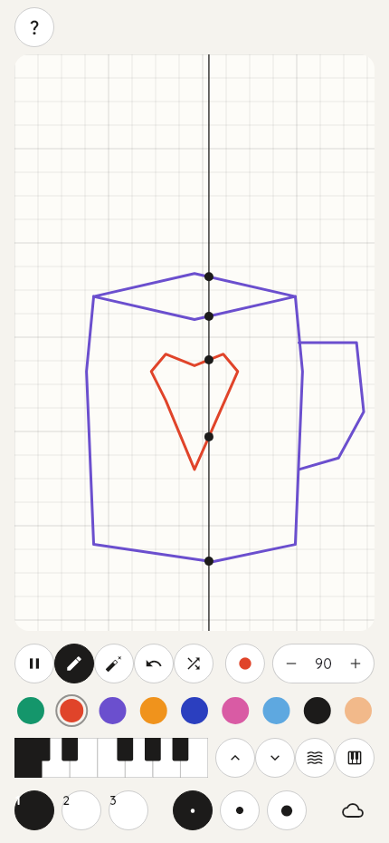

# Artboard

Draw a picture, play it as music.



Artboard is a drawing app where the canvas is also an instrument. A scan
line sweeps the paper from left to right; wherever it crosses a stroke it
plays a note. Vertical position is pitch, colour is the instrument, and
horizontal position is when the note hits. Pick a key and a scale first,
then doodle. Loops, beats and melodies fall out of shapes.

## Features

| Feature | What it does |
|:--------|:-------------|
| Scan-line playback | Sweeps the drawing every four beats, dots show live notes |
| Key + scale picker | Mini piano strip for the root, six scales including pentatonic and blues |
| Colour instruments | Each of the nine pen colours is a different waveform and octave |
| Three layers | Keep a bass line on one layer and a melody on another |
| Tools | Pen, eraser, undo, three stroke widths, random doodle button |
| Tempo | 40–200 BPM sweep speed |
| WAV export | Renders one loop offline and saves it as a file |
| Save / restore | Persists the drawing on the device |
| i18n | English and Chinese, no hardcoded strings |

## Getting started

Requires the Flutter SDK (3.44 or later).

```bash
flutter pub get
flutter run            # pick a connected device
flutter run -d linux   # desktop
flutter run -d chrome  # web
```

Draw on the paper, press play. Higher strokes are higher notes.

## Building

```bash
flutter build web --release
flutter build linux --release
flutter build apk --debug
flutter build windows   # on a Windows machine
flutter build macos     # on a Mac
flutter build ios       # on a Mac with Xcode
```

## Testing

The test suite covers the music engine, geometry, controllers, widget
behaviour and golden screenshots. It holds 100% line coverage of the
handwritten code under `lib/`.

```bash
flutter test              # unit + widget + golden tests
flutter test --coverage   # writes coverage/lcov.info
flutter test --update-goldens test/golden_test.dart   # refresh screenshots
```

## How a drawing becomes sound

Strokes are polylines. For each frame the engine intersects every segment
with the scan line's x position; a segment fires once when the line enters
its x range. The intersection's y coordinate maps onto a scale degree in
the selected key, the stroke's colour picks the instrument, and a small
pure-Dart synthesizer renders the waveform to PCM for playback. The same
scheduler also mixes a full loop offline when you export a WAV.

## License

[GNU AGPL v3](LICENSE)
